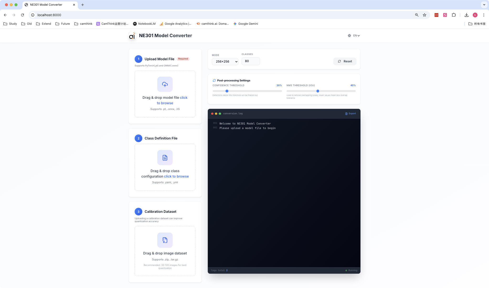
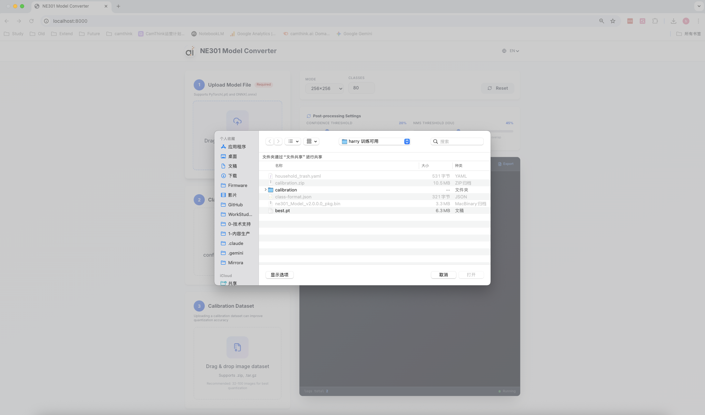
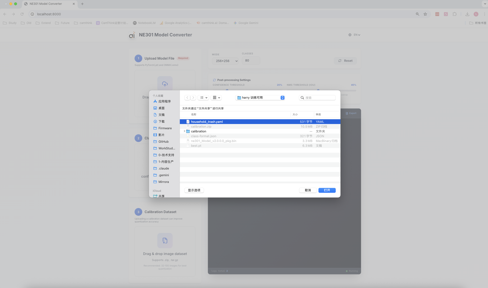
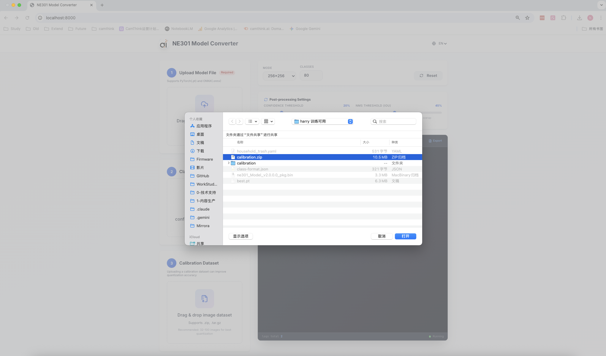
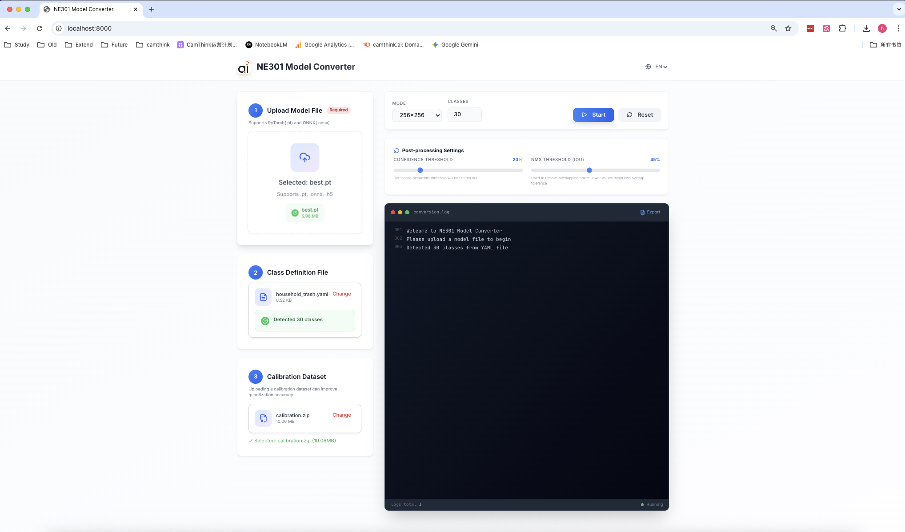
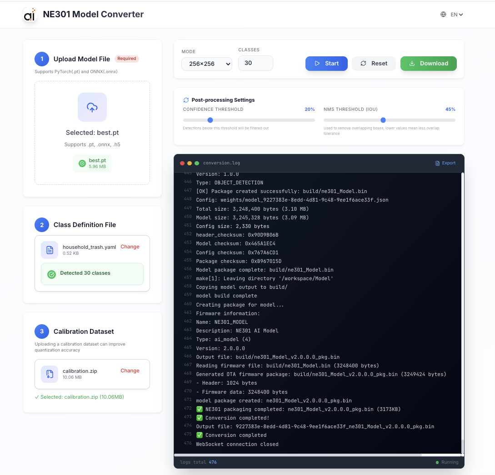
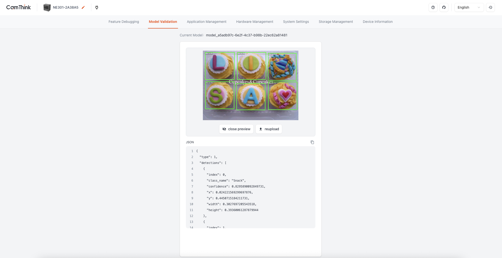

# 快速开始指南 - NE301 模型转换器

**5 分钟教程：转换您的第一个模型**

本指南将带您通过 Web 界面将 PyTorch 模型转换为 NE301 `.bin` 格式。

---

## 📋 前置要求

开始之前，请确保您有：

- ✅ **Docker Desktop** 已安装并运行
- ✅ **4GB+ 内存** 可用
- ✅ **10GB+ 磁盘空间**
- ✅ **网络连接**（用于拉取 Docker 镜像）

---

## 🚀 步骤 1: 启动服务

### 1.1 拉取 NE301 Docker 镜像

```bash
docker pull camthink/ne301-dev:latest
```

这将下载 NE301 工具链（约 3GB）。根据您的网速，可能需要 5-10 分钟。

### 1.2 启动转换器服务

```bash
# 克隆仓库
git clone https://github.com/harryhua-ai/model-converter.git
cd model-converter
git submodule update --init --recursive

# 启动服务
docker-compose up -d
```

等待服务启动（约 2 分钟）。您将看到：

```
✔ Container model-converter-api  Started
```

### 1.3 访问 Web 界面

打开浏览器并访问：

```
http://localhost:8000
```

您应该看到 NE301 模型转换器界面：



---

## 📦 步骤 2: 上传模型和配置

### 2.1 上传 PyTorch 模型

点击 **"上传模型"** 区域并选择您的 PyTorch 模型文件：

- 支持格式：`.pt`、`.pth`、`.onnx`
- 最大大小：500MB
- 示例：`example/best.pt`（6MB YOLOv8 模型）



### 2.2 上传类别定义（YAML）

上传包含类别定义的 YAML 文件：

```yaml
# 示例：example/test.yaml（30 类家庭物品）
names:
  - Banana
  - Apple
  - Orange
  - Tomato
  # ... 共 30 个类别
```



### 2.3 上传校准数据集

**上传校准数据集（强烈建议）**：

- **格式**：包含图片的 ZIP 文件
- **图片**：32-100 张代表性图片
- **格式**：`.jpg`、`.png`
- **示例**：`example/calibration.zip`（10MB，约 50 张图片）



**为什么要校准？**
- 提高量化精度 5-15%
- 使用真实数据分布进行优化
- **强烈建议**用于生产模型

---

## ⚙️ 步骤 3: 配置转换

### 3.1 选择预设

根据您的需求选择转换预设：

| 预设 | 输入尺寸 | 速度 | 精度 | 使用场景 |
|------|---------|------|------|----------|
| **快速** | 256x256 | ⚡⚡⚡ | ⭐⭐ | 实时检测（默认）|
| **平衡** | 320x320 | ⚡⚡ | ⭐⭐⭐ | 通用场景 |
| **高精度** | 480x480 | ⚡ | ⭐⭐⭐⭐ | 精度要求高 |

### 3.2 开始转换

点击 **"开始转换"** 按钮：



---

## ✅ 步骤 4: 下载并部署到 NE301

转换完成后（通常 2-5 分钟）：



### 4.1 下载 .bin 文件

点击 **"下载 .bin"** 获取您的 NE301 兼容模型。

### 4.2 部署到 NE301 设备

**通过 NE301 网页界面上传 `.bin` 文件：**

1. 访问 NE301 设备网页界面
2. 导航到模型上传区域
3. 选择下载的 `.bin` 文件
4. 上传并等待验证

**验证模型正确加载：**



**成功指标：**
- ✅ 模型加载无 OOM 错误
- ✅ 推理成功运行
- ✅ 输出符合预期结果

---

## 🎉 恭喜！

您已成功将第一个 PyTorch 模型转换为 NE301 格式！

### 接下来做什么？

- 📖 **[API 参考](API_REFERENCE_cn.md)** - 编程方式使用
- 🔧 **[故障排查](TROUBLESHOOTING_cn.md)** - 解决常见问题
- 🏗️ **[架构说明](ARCHITECTURE_cn.md)** - 了解流程
- 🐳 **[Docker 部署](DOCKER_DEPLOYMENT_cn.md)** - 高级配置

---

## 🐛 常见问题

### 问题：Docker 未运行

**症状**: `Cannot connect to the Docker daemon`

**解决方案**:
```bash
# 启动 Docker Desktop
open -a Docker

# 验证
docker ps
```

### 问题：端口 8000 已被占用

**症状**: `port is already allocated`

**解决方案**:
```bash
# 查找占用端口 8000 的进程
lsof -i :8000

# 停止旧容器
docker-compose down

# 重启
docker-compose up -d
```

### 问题：转换失败

**症状**: 进度卡住或出现错误消息

**解决方案**:
1. 检查日志：`docker-compose logs -f`
2. 验证模型格式（必须是 `.pt` 或 `.pth`）
3. 确保 YAML 文件有效
4. 先尝试不上传校准数据集

**📖 [完整故障排查指南](TROUBLESHOOTING_cn.md)**

---

## 📚 示例文件

使用仓库中提供的示例文件：

```bash
# example/ 目录下的示例文件：
example/
├── best.pt           # 6MB YOLOv8 模型（30 类家庭物品）
├── test.yaml         # 类别定义（30 个类别）
└── calibration.zip   # 校准数据集（10MB，约 50 张图片）

# 或下载示例 YOLOv8 模型
wget https://github.com/ultralytics/assets/raw/main/yolov8n.pt
```

---

## 💡 专业提示

### 提示 1: 使用校准数据集
- 提高精度 5-15%
- 使用来自您使用场景的代表性图片
- 50-100 张图片最佳

### 提示 2: 选择正确的预设
- **快速 (256x256)**：实时应用（30+ FPS）- 默认
- **平衡 (320x320)**：通用场景（20-30 FPS）
- **高精度 (480x480)**：精度关键场景（10-20 FPS）

### 提示 3: 监控资源
```bash
# 检查容器资源使用情况
docker stats model-converter-api
```

### 提示 4: 保留日志
```bash
# 保存日志用于故障排查
docker-compose logs > conversion.log
```

---

## 🆘 需要帮助？

- **邮箱**: support@camthink.ai
- **文档**: [完整文档](../CLAUDE.md)

---

**最后更新**: 2026-03-19
